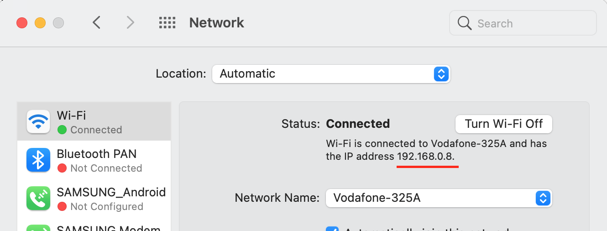
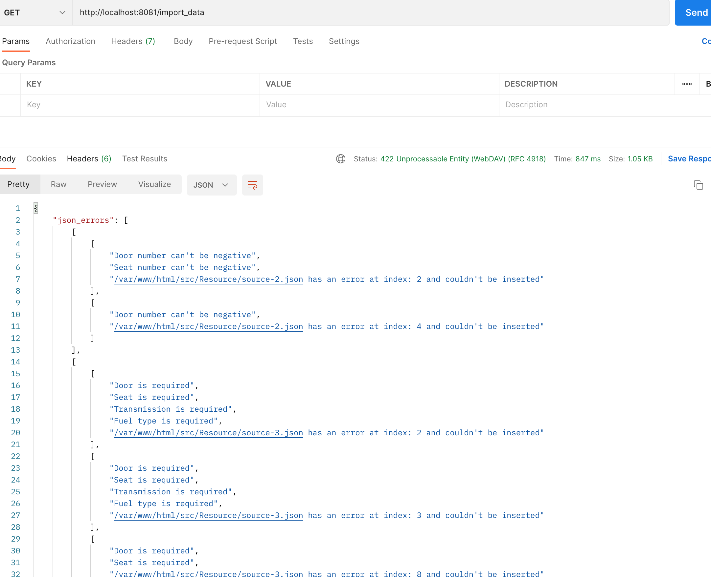
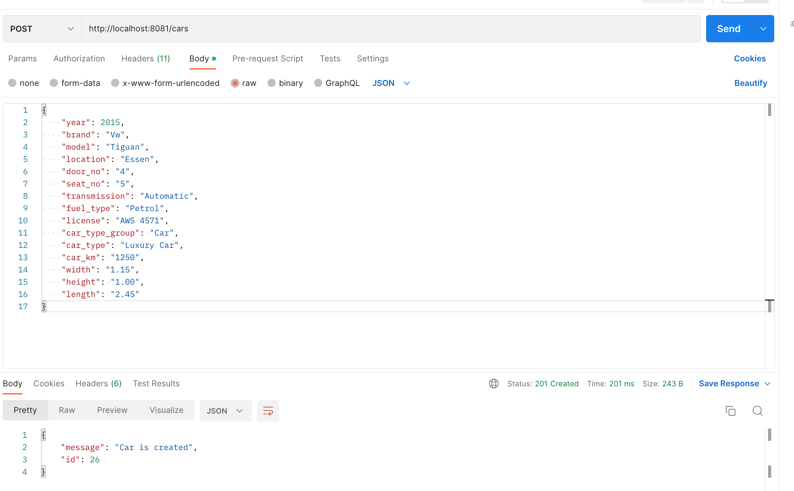

# Car Data Reader

This project reads the car data from CSV and json files and after validation, inserts the data into mysql database. Several endpoints are developed to retrieve and create car datasets into the database. The project is build on the docker container. It consists of Nginx:latest, php:8-fom, mysql:8.0 and phpmyadmin containers.

# Installation

To build the docker container, first environmental variable should be set. For this, an environmental file called .env found in "app" folder should be updated accordingly. For the sake of simplicity the default values are set in the .env file but one can change these according to his machine configurations.

Environmental variable (in .env file) called "IP_ADDRESS_MAC" is taken from the machine's network preference to do the functional test of the API endpoints. It can differ from machine to machine. So, please check your machine IP address and set the value there.

Please see the image below to get the IP from a Macbook:


port numbers for containers depending on machine can be updated in the "docker-compose.yml" file in the root directory.

After setting the environmental variables and port number (if needed), go into the project folder in bash and run the following code to build and start the containers.

```bash
docker compose --env-file app/.env build && docker compose --env-file app/.env up -d
```

Then the following command to install dependencies:

```bash
docker-compose exec php-fpm composer install
```

To read and import the data from CSV and json files to database, you have to call the following API with GET method in an API client or in browser:
```bash
http://localhost:8081/import_data
```
Notice the port number 8081 is set in docker-compose.yml for nginx service.

After validation all valid data will be inserted in the database and error messages which data are not able to insert will be shown for the respective file names and index. See screenshot below:



# Folder Structure

Codes and tests for the project will be found in the "app/src" folder.
1. Controller folder has the API endpoints scripts
2. Resource folder has the csv, json files, a testingFiles subfolder has files for testing data validation
3. Service folder has the services which are needed to read, DB insertion, validation and API related scripts
4. tests folder has two sub folders which consists functional and unit tests 

# API endpoints

To get the all car lists call the following API with GET method:
```bash
http://localhost:8081/cars
```

To get a single car list call the following API with GET method:
```bash
http://localhost:8081/cars/10
```
here, "10" is the id property of a car from the car table in database which can also be found from get all car API's returned data.

To add a car call the following API with POST method:
```bash
http://localhost:8081/cars
```
The field names are: 
1. year
2. brand
3. model
4. location
5. door_no 
6. seat_no 
7. transmission 
8. fuel_type 
9. license 
10. car_type_group
11. car_type 
12. car_km 
13. width 
14. height 
15. length

see screenshot to add car:


# Validation

1. All the properties are validated with max or min character count
2. Year, brand, model, door number, seat number, transmission, fuel type are considered as required and not empty or null
3. door number, seat number, year, car km, width, height, length can't be negative 
4. year can have max 4 character, seat number, door number can have max 2 characters.
5. door number, seat number, transmission, fuel type can have max 50 characters.
6. data duplication is checked while inserting in DB with create API or initial "import data" API based on querying all criterias

# Testing
Testing scripts written could be found in testing folder which consist of functional and unit test in FunctionalTest and UnitTest sub folders respectively. Run the following command to to test:

```bash
docker-compose exec php-fpm vendor/bin/phpunit
```
The test output:
